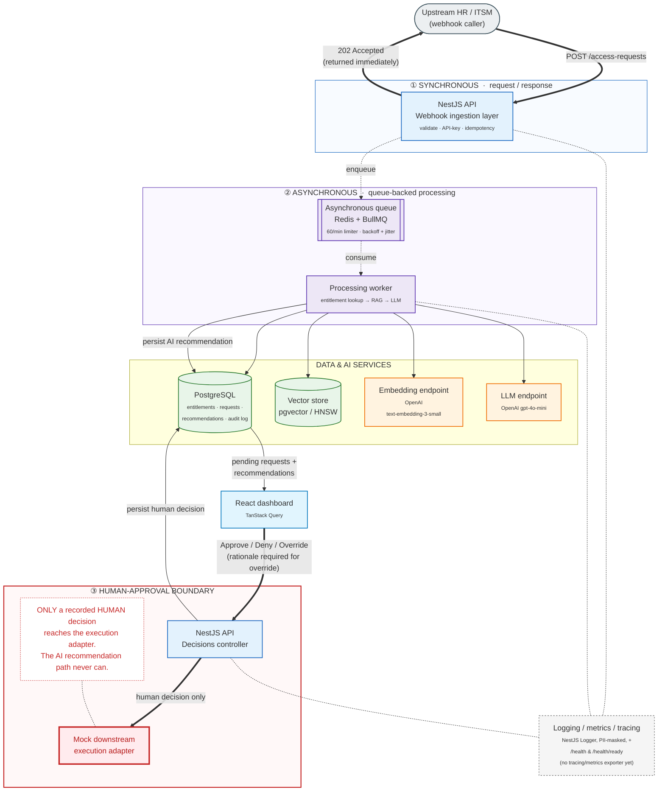

# System Architecture Blueprint

Component boundaries for Policy Pilot, numbered in the order a request actually
moves through them. A rendered version is also committed as
[`architecture-blueprint.svg`](architecture-blueprint.svg); this Mermaid source
renders natively on GitHub.

- **① Synchronous** — the webhook call and its `202 Accepted` response happen
  before any AI work starts.
- **② Asynchronous** — the queue and worker process the request in the
  background, on their own schedule, rate-limited independently of how fast
  requests arrive.
- **③ Human-approval boundary** — the mock execution adapter is reachable
  *only* from a recorded human decision (`Decisions controller`). The AI
  recommendation path (worker → LLM → persisted recommendation) has no route
  to it at all — that's enforced by the code having no such call, not by a
  runtime check.

Note: `Ingestion` and `Decisions` are drawn as two nodes because they are two
distinct NestJS controllers in the same running API process
(`backend/src/ingestion/ingestion.controller.ts` and
`backend/src/decisions/decisions.controller.ts`) — not two separate deployed
services.
